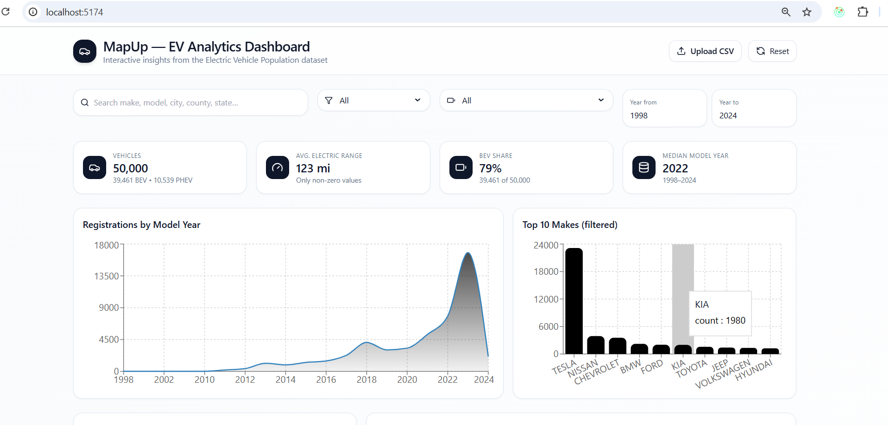
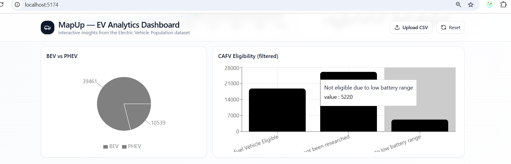
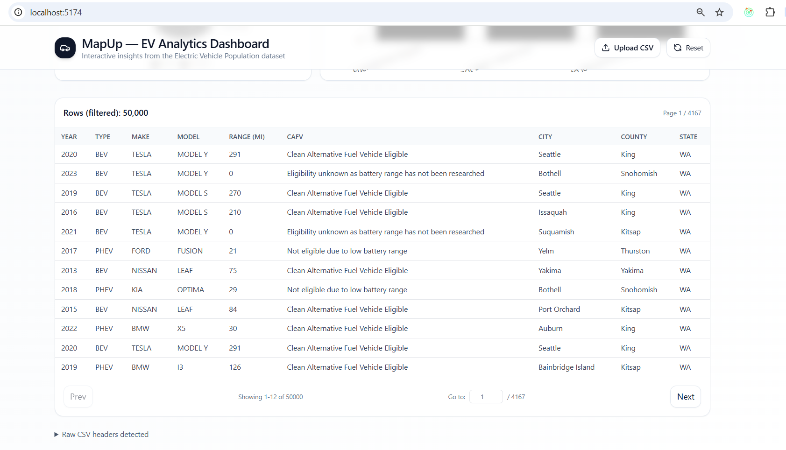

MapUp — EV Analytics Dashboard

An interactive React-based dashboard to explore and analyze Electric Vehicle Population Dataset.
It provides insights such as total vehicles, EV type share (BEV vs PHEV), model year trends, top manufacturers, CAFV eligibility, and more.

🚀 Features

CSV Upload & Auto-load: Load Electric_Vehicle_Population_Data.csv automatically or upload your own.

Search & Filters: Search by make, model, city, county, or state. Filter by EV type, manufacturer, and year range.

Interactive KPIs:

Total vehicles
Average electric range
BEV share %
Median model year
Charts & Visuals (Recharts):
Registrations by model year (area chart)
Top 10 makes (bar chart)
BEV vs PHEV share (pie chart)
CAFV eligibility breakdown (bar chart)
Paginated Table: Explore filtered rows with sorting & navigation.
Responsive Design: Works across desktop and mobile.
Framer Motion Animations for smooth transitions.

🛠️ Tech Stack

React (frontend framework)
Recharts (charts & visualizations)
PapaParse (CSV parsing)
Framer Motion (animations)
Lucide Icons (modern icons)
TailwindCSS (styling & layout)
⚡ Getting Started

1. Clone the repository
   git clone https://github.com/Shivani-Chovatiya/Analytics-Dashboard
   cd ev-analytics-dashboard

2. Install dependencies
   npm install

3. Run the app
   npm run dev

Now open http://localhost:5174
in your browser.

🖼️ Screenshots
Dashboard Overview

📊 Usage

By default, the dashboard tries to load /Electric_Vehicle_Population_Data.csv.
You can upload your own CSV using the Upload CSV button.
Adjust filters and search to update KPIs, charts, and tables interactively.

📁 Dataset Requirements

Your CSV should include the following columns (case-insensitive, flexible names supported):

Make
Model
Model Year
Electric Vehicle Type (BEV or PHEV)
Electric Range
CAFV Eligibility
City, County, State

Example:

Make Model Model Year Electric Vehicle Type Electric Range CAFV Eligibility City County State
Tesla Model 3 2022 BEV 310 Eligible Seattle King WA

🔮 Roadmap

Add map visualization (geo-location by city/county/state).
Export filtered data to CSV.
Advanced filtering (multi-select for makes, CAFV status).

🤝 Contributing

Pull requests are welcome! Please open an issue first to discuss what you’d like to change.
